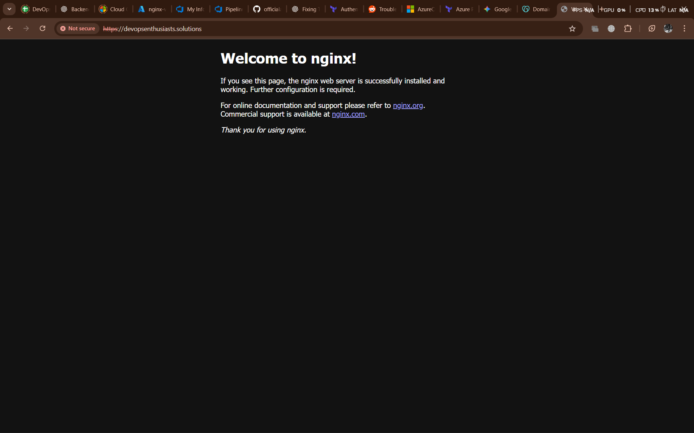

# For development
terraform apply -var-file="environments/dev.tfvars"

# For production
terraform apply -var-file="environments/prod.tfvars"


# Resource for backend 
az group create --name tfstate-rg --location eastasia
# Storage account for backend in tfstate-rg
az storage account create \
  --name tfstate12345abc123 \
  --resource-group tfstate-rg \
  --location eastasia \
  --sku Standard_LRS

# Storage container for backend tfstate
az storage container create \
  --name tfstate \
  --account-name tfstate12345abc123


- **main.tf** – Defines the VM, NIC, public IP, and NSG.
- **variables.tf** – Contains all variables for VM deployment.
- **outputs.tf** – Outputs like VM public IP.
- **backend.tf** – Terraform backend configuration.
- **dev.tfvars** – Environment-specific variable values.
- **modules/nginx-app/** – Contains Dockerfile, Nginx config, and setup script.
- **azure-pipeline.yml** – Azure DevOps pipeline configuration.

---
## Project Setup Screenshot


---
## Deployment Steps

### 1. Terraform Setup
- Installed Terraform 1.8.0 via Azure DevOps TerraformInstaller task.
- Configured Azure service connection and added SPN credentials to the environment (`addSpnToEnvironment: true`).

### 2. Network Configuration
- Created **Network Security Group (NSG)** with rules:
  - **SSH (port 22)** – allows remote login
  - **HTTP (port 80)** – allows web access
- Created **public IP** and associated it with VM’s NIC.

### 3. VM Deployment
- Created Ubuntu 18.04 VM with:
  - Password-based SSH enabled.
  - Attached NIC, NSG, and public IP.
- Applied Terraform plan successfully and fetched the VM public IP.

### 4. Nginx Deployment
- Copied `nginx-app` module to VM using `scp`.
- Ran `setup_nginx.sh` to:
  - Install Docker
  - Build the Dockerized Nginx image
  - Run the container mapping ports 80 and 443

---
## Folder structure for terraform code


---

## Issues Encountered and Resolutions

1. **Terraform authentication error**
Authenticating using the Azure CLI is only supported as a User (not a Service Principal)

**Cause:** CLI authentication used with a Service Principal incorrectly.  
**Fix:** Added `addSpnToEnvironment: true` in AzureCLI@2 task to export SPN credentials.

2. **SSH connection refused**
ssh: connect to host <IP> port 22: Connection refused

**Cause:** NSG rules or VM not fully ready.  
**Fix:** Verified NSG allows inbound port 22 and added a retry loop in the pipeline to wait for SSH availability.

3. **Incorrect VM username in variables**
- **Cause:** SSH failed due to mismatched username.  
- **Fix:** Updated `vm_user` variable to the correct VM admin username (`azureuser`).

4. **Automated SSH in pipeline failing**
- **Cause:** SSH attempted before VM was ready or incorrect variable usage in `sshpass`.  
- **Fix:** Added a retry check in the pipeline:
  ```bash
  until sshpass -p $VM_PASS ssh -o StrictHostKeyChecking=no $VM_USER@$VM_IP 'echo SSH ready'; do
    echo "Waiting for SSH..."
    sleep 10
  done
  ```
- Ensured `setup_nginx.sh` ran successfully once SSH was available.

---

## Final Outcome
- Terraform provisioned the VM, NSG, public IP, and NIC correctly.
- Dockerized Nginx container is running and accessible via HTTP on the public IP.
- Pipeline automates VM provisioning, file transfer, and Docker setup reliably.

---

## Notes
- Ensure **NSG allows inbound ports 22 and 80**.
- VM username and password must match pipeline variables.
- Pipeline waits for SSH to be ready before executing commands on the VM.

---

## Lessons Learned
- Terraform authentication differs for users vs service principals.
- Automating SSH connections in pipelines requires timing checks and correct credentials.
- Debugging Azure connectivity often involves checking NSG, VM status, and SSH service.

---
## SSL working :Accessible on domain



---

## Accessing the VM
```bash
ssh azureuser@<VM_PUBLIC_IP>

Once logged in, the Nginx app can be accessed via:
http://<VM_PUBLIC_IP>
Also accessible on my own domain: https://devopsenthusiasts.solutions
```


# nginx-app
---

## Project Overview

This project contains a simple **Nginx web server** setup running inside a Docker container. It is designed to:

- Serve static web content.
- Automatically redirect HTTP traffic to HTTPS.
- Use a self-signed SSL certificate for HTTPS.
- Be easily deployed on an Ubuntu VM with Docker installed.

The setup includes:

- `Dockerfile` — Builds the Nginx container with SSL configuration.
- `nginx.conf` — Custom Nginx configuration enabling HTTP → HTTPS redirection.
- `setup_nginx.sh` — Script to install Docker, build the container, and run it.

---

## Prerequisites

- Ubuntu 18.04 or higher
- Docker installed on the VM (can be installed via the `setup_nginx.sh` script)
- Access to the VM via SSH
- Public IP of the VM (used for deployment and accessing the site)

---

## Nginx Configuration

- **HTTP (Port 80)**: Redirects all traffic to HTTPS.
- **HTTPS (Port 443)**: Serves static content from `/usr/share/nginx/html` using a self-signed certificate.
- **Certificate Directory**: `/etc/nginx/certs`
- **Self-Signed Certificate**: Generated during Docker build, valid for 1 year.

---

## Deployment Instructions

### Step 1: Copy files to the VM

```bash
scp -r nginx-app/* azureuser@<VM_PUBLIC_IP>:~/nginx-app/ 
```


